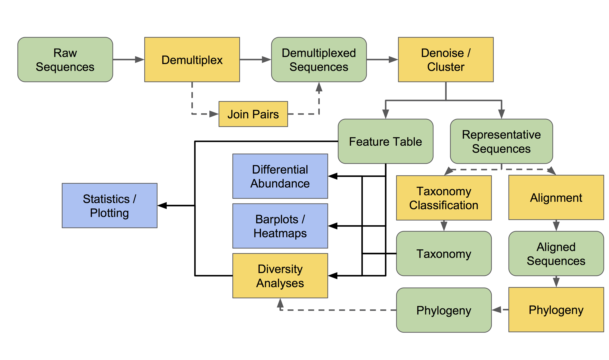

# QIIME2 primer

## What is QIIME2?  

As described on the QIIME2 portal :

???+ quote "What is QIIME 2?"
    QIIME 2 is a powerful, extensible, and decentralized microbiome analysis package with a focus on data and analysis transparency. In this course, it is used to process the 16S rRNA sequencing reads before the downstream analysis.  

!!! important "For this course"
    You do **not** need to install or run QIIME 2 during the practical.  
    The QIIME 2 processing has already been performed for you. During the practical, we will explain what each processing step does and inspect the corresponding output files.

## QIIME2 Overview

The figure below gives an overview of the main types of analyses that can be performed in QIIME 2.

From https://docs.qiime2.org/2023.7/tutorials/overview/:
{ align=left }

## QIIME2 Artifacts and visualizations 

In QIIME2 uses two file types that you will encounter throughout the practical: these contain not only data but also additional information on the generation of the file itself. Therefore, before we start working with QIIME2, we need to import our data as a QIIME2 artifact. 

Additional info: As described on the QIIME2 website (https://docs.qiime2.org/2023.7/concepts/): 

“Artifacts enable QIIME 2 to track, in addition to the data itself, the provenance of how the data came to be. With an artifact’s provenance, you can trace back to all previous analyses that were run to produce the artifact, including the input data used at each step. This automatic, integrated, and decentralized provenance tracking of data enables a researcher to archive artifacts, or for example, send an artifact to a collaborator, with the ability to understand exactly how the artifact was created. This enables replicability and reproducibility of analyses, as well as generation of diagrams and text that can be used in the methods section of a paper. Provenance also supports and encourages the proper attribution to underlying tools (e.g. FastTree to build a phylogenetic tree) used to generate the artifact.”

Before we get started, let's briefly discuss the two main file types used with QIIME2. These are `.qza` files and `.qzv` files.

`.qza` - The QIIME2 artifact file. These contain data.

`.qzv` - The QIIME2 visualization file. These contain visualizations that can be viewed using [QIIME 2 View](https://view.qiime2.org/).

In this course, we will mostly be using Qiime2view to visualise (instead of unzipping the qza file). You simply need to drag and drop the file of interest. 

