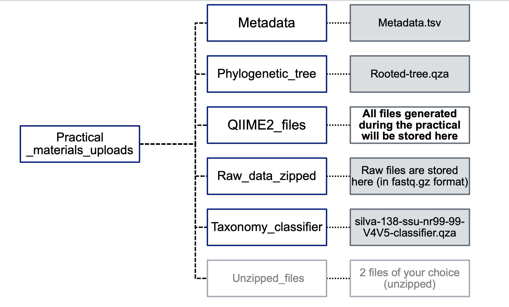
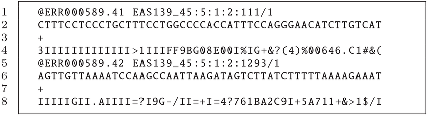

# Workflow

## PRELIMINARY READ PROCESSING

In our pipeline we will be working with reads that have already been demultiplexed. You will need to download the following starting folder for your analyses: Practical_materials_uploads. The folder is structured as follows.

### Folder Structure

{ align=left }

For each sample, there are two fastq files (R1 and R2). R1 corresponds to all the forward reads and R2 to all the reverse reads.

We will first look at the fastq files, then check the quality of the reads with FastQC and MultiQC, and then conduct read processing in QIIME2 (denoising and OTU clustering). Follow the steps below:

### 1.	Check the [fastq files](https://knowledge.illumina.com/software/general/software-general-reference_material-list/000002211#)
After sequencing, the output is provided in the form of two FASTQ files per sample, one labelled R1 (forward reads) and one labelled R2 (reverse reads). Each FASTQ file contains reads, and these are provided as an entry with 4 lines: 

1.	The first line contains a sequence identifier, including information about the sequencing run and the cluster. It usually begins with an “@”.
2.	The second line contains the base calls of the sequence (A, C, T, G and N).
3.	The third line comprises a plus (+) sign, which acts as a separator.
4.	The fourth line, which is important for the next step, provides information on the quality of each of the base calls. These are Phred +33 encoded, using ASCII characters to represent the numerical quality scores.

An example of one entry of a FASTQ file (note that this corresponds to only one read of hundreds or thousands sequenced):
{ align=left }

???+ danger "Exercise 1"
    Select two fastq files, one corresponding to forward reads (R1) and one corresponding to reverse reads (R2). Copy them to a new folder called Raw_data_unzipped. Unzip them either with double clicking (on a Windows machine) or by running the following command gzip -d NAME_OF_THE_FILE (on a Mac). Next, explore the files using the command line (**tip:** use the commands you learnt previously).

???+ question "Question(s):"
    1.	Is the file format as expected?
    2.	How many reads (entries) are there in each of these two files?

### 2.	 Quality check using FastQC 
We now examine the quality of the bases. This will help us determine if there are parts of the reads that need to be trimmed/truncated. 

For the two fastq files you selected earlier, run fastqc as follows:
Access the folder with all the raw .fastq (navigate with the `cd` command) files through Terminal (Mac Users) or Powershell (Windows Users). Next run the following command: 

=== "Mac"

    ``` bash
    fastqc *.fastq
    ```

=== "Windows"

    ``` bash
    docker run --rm -v ${PWD}:/data/ -w /data/ -it pegi3s/fastqc IL10-1_S13_L001_R1_001.fastq
    ```
    Run this command independently for each unzipped file (in your Raw_data_unzipped folder). 

???+ question "Question(s):"
    1.	Overall, which fastq file has higher quality scores, the R1 or R2?
    2.	In each of these files, at which position do you observe a steep decline in base quality?


### 3.	QIIME2

We will now use QIIME2 for the next steps in the workflow: these involve importing the fastq files, trimming the primers, "cleaning up" the reads the merging the forward and reverse reads, generating a table containing information on the reads and their abundance, assigning taxonomy to these reads, and carrying out statistical analyses on bacterial diversity. 

#### 3.1 Activate QIIME 2 environment
Set the path to the correct directory after downloading the necessary folder from Switchdrive (https://drive.switch.ch/index.php/s/i97MUDfcbcFNQVp)

As a first step, activate QIIME with the following command (before doing so, navigate into the folder where you downloaded and unzipped the file from Switchdrive "Practical_materials_uploads"):

=== "Mac"

    ``` bash
    conda activate qiime2-2023.5
    ```

=== "Windows"

    ``` bash
    docker run --rm -v ${pwd}:/data/ -w /data/ -it quay.io/qiime2/core:2023.5
    ```

#### 3.2. Import raw data
Next, you will import the raw data (fastq files) by running qiime *tools import*. Notice that with this tool, each of the parameters you can provide starts with two dashes. Here you will be specifying the following parameters:

* type: whether your data is single-end or paired-end
* input-format specifies the format of the data. The available choices are provided [here](https://docs.qiime2.org/2023.7/tutorials/importing/#sequence-data-with-sequence-quality-information-i-e-fastq)
* output-path: species the output path of the artefact you generate.

Run the following command:

``` bash
qiime tools import \
    --type 'SampleData[PairedEndSequencesWithQuality]' \
    --input-path Raw_data_zipped \
    --input-format CasavaOneEightSingleLanePerSampleDirFmt \
    --output-path QIIME2_files/demux-paired-end.qza
```
 
##### 3.2.1 Summarise imported data and visualise
You can now check whether the data was imported by running qiime demux summarise, specifying the name of the input file and the name of the artefact you want to generate. You can visualise this artefact by dropping it in QIIME2 view (https://view.qiime2.org/). 

``` bash
qiime demux summarize \
    --i-data QIIME2_files/demux-paired-end.qza \
    --o-visualization QIIME2_files/demux-paired-end-summary.qzv  
```

???+ question "Question(s):"
    === "Basic - Check the “Overview” tab"
        1.	How many forward and reverse reads are there overall?
        2.	For the samples you examined on FastQC, how many forward reads and reverse reads are there?
        3.	Do any samples stand out eg have a particularly high or low number of reads? 
    === "Advanced – check the “Interactive” tab"
        1.	Look at the plots and the quality scores: What trends do you observe in terms of quality score changes in the forward and reverse reads?
        2.	Scroll down to the “Demultiplexed sequence length summary”: What is the read length? How much overlap do you expect for the forward and reverse reads? 

#### 3.3 Remove primers with Cutadapt
We need to remove the primers that were used for targeted amplification. To do this we use *cutadapt trim-paired*, specifying these main parameters:

* forward primer: which is “GTGYCAGCMGCCGCGGTAA”
* reverse primer: which is “CCGYCAATTYMTTTRAGTTT”
* whether you have wobble bases
* whether you should discard reads that were not trimmed

???+ tip "tip:" 
    --verbose: The verbose option specifies that you want to display detailed processing information on your screen. 

```bash
qiime cutadapt trim-paired \
    --i-demultiplexed-sequences QIIME2_files/demux-paired-end.qza \
    --p-front-f GTGYCAGCMGCCGCGGTAA \
    --p-front-r CCGYCAATTYMTTTRAGTTT \
    --p-match-adapter-wildcards \
    --p-discard-untrimmed \
    --verbose \
    --o-trimmed-sequences QIIME2_files/paired-end-demux-trimmed.qza | tee QIIME2_files/cutadaptresults.log
```

Summarise the .qza artefact using the command below, and then visualise the trimmed reads in QIIME 2 view (https://view.qiime2.org/). 

```bash
qiime demux summarize \
    --i-data QIIME2_files/paired-end-demux-trimmed.qza \
    --o-visualization QIIME2_files/paired-end-demux-trimmed-summary.qzv 
```

???+ question "Question(s):"
    === "Basic - Check the “Overview” tab"
        1. What are wobble bases? What does --p-match-adapter-wildcards do?  Tip: go to the Cutadapt website to find out (https://cutadapt.readthedocs.io/en/stable/)
        2. What does --p-discard-untrimmed do? What kinds of reads might not get trimmed? 
        3. For the same samples explored earlier, how many reads are there?
    === "Advanced – check the “Interactive” tab"
        1.	What are the read lengths now? What was the length of the primer sequences? 


#### 3.4 Denoise with DADA2

Now we will “denoise” the reads, that is, carry out a series of steps with the goal of retaining “true” reads, those that represent the taxa that are present in the sample. These reads may differ by one nucleotide, and they are referred to as exact sequence variants (ESVs) or amplicon sequence variants (ASVs). 

As we are working with paired end reads, we use qiime2 *dada2 denoise-paired*. Through this command, quality filtering, merging of forward and reverse reads, dereplication and removal of chimeras is conducted. 

The quality filtering aspect refers to trimming the ends of reads where quality is suboptimal, users can also discard sequences below a particular length. This step is done first to optimize the merging of forward and reverse reads. The merging is done according to default parameters (not specified in the command). 

Dereplication refers to checking the presence of all identical sequencing reads and then reducing these to one “unique sequence” with a note of its abundance.  Removal of chimeras refers to the removal of sequences that are “hybrids” of different parent sequences, and which do not correspond to true ASVs.

Here we will be specifying the following parameters: 

* Truncation length for forward reads: at what length the forward reads will be cut and all reads below this length will be discarded
* Truncation length for reverse reads: at what length the reverse reads will be cut and all reads below this length will be discarded
 
Note that now we will have 3 output files:

* an abundance table comprising the unique sequences and their abundance
* a fasta file with the unique sequences, which we refer to as the representative sequences
* a file containing the statistics for the denoising steps

You can find more information on DADA2 here (https://benjjneb.github.io/dada2/).

Run the following command: 
 
```bash
qiime dada2 denoise-paired \
    --i-demultiplexed-seqs QIIME2_files/paired-end-demux-trimmed.qza \
    --p-trunc-len-f 225 \
    --p-trunc-len-r 225 \
    --o-table QIIME2_files/table.qza \
    --o-representative-sequences QIIME2_files/rep-seqs.qza \
    --o-denoising-stats QIIME2_files/denoising-stats.qza 
```

##### 3.4.1 Summarize read counts

We will now summarise the number of reads that we have in each sample, having done the denoising. We use  *feature-table summarize*, providing a metadata file that contains information about our samples. 

Run the following command: 
```bash
qiime feature-table summarize \
    --i-table QIIME2_files/table.qza \
    --o-visualization QIIME2_files/table.qzv \
    --m-sample-metadata-file Metadata/metadata.tsv
```

Open QIIME2 view (https://view.qiime2.org/) and drop the table.qzv in the drag&drop window to see the results. 

???+ question "Question(s):"
    1. In the overview tab, what does number of features refer to?
    2. In the interactive tab, quantitatively compare the number of reads before and after denoising for all 18 samples.
    3.	Get together in pairs, and calculate the percentage of reads that have been retained for each sample. 


**Optional command:** Visualise the representative sequences after denoising with DADA2
We use qiime feature-table tabulate-seqs to see the unique/representative sequences.

Run the following command: 

```bash
qiime feature-table tabulate-seqs \
    --i-data QIIME2_files/rep-seqs.qza \
    --o-visualization QIIME2_files/rep-seqs.qzv
```

???+ question "Question(s):"
    1. After running denoising with DADA2, we have obtained a set of amplicon sequence variants or exact sequence variants. Why is the length of these sequences different to that of the reads in the first fastq files you looked at?  


#### 3.5  Assign taxonomy
We now assign taxonomy to the unique/representative sequences found across all samples. We do this with the q2-feature-classifier plugin, making use of a pre-trained Naive Bayes classifier. This classifier is an algorithm that was trained on the SILVA reference database (downloadedDecember 2019) comprising hundreds of thousands of bacterial sequences with taxonomic information. The output is a file containing the results for the different taxonomic ranks (from domain to species), and the level of confidence for the taxonomic assignment. 

```bash 
qiime feature-classifier classify-sklearn \
    --i-classifier Taxonomy_classifier/silva-138-ssu-nr99-99-V4V5-classifier.qza \
    --i-reads QIIME2_files/rep-seqs.qza \
    --o-classification QIIME2_files/taxonomy.qza
```

##### 3.5.1 Tabulate the taxonomy with the following command:

```bash
qiime metadata tabulate \
    --m-input-file QIIME2_files/taxonomy.qza \
    --o-visualization QIIME2_files/taxonomy.qzv
```


???+ question "Question(s):"
    === "Basic"
        1. What are the different taxonomic ranks that are being assigned?
        2. Are there any sequences that are not bacterial? If so, what are they?
    === "Advanced"
        1. Choose one of the features (ASVs), can you find its nucleotide sequence in another file? Once you have done so, check the taxonomic output obtained using blast, which implements a different algorithm. You can do so [here:](https://blast.ncbi.nlm.nih.gov/Blast.cgi?PROGRAM=blastn&PAGE_TYPE=BlastSearch&LINK_LOC=blasthome). Is the taxonomic assingment the same or different?

#### 3.6 Filter non-bacterial sequences

Our library preparation and sequencing targets the prokaryotic 16S rRNA gene, but we may end up obtaining reads that are not prokaryotic eg from chloroplasts or mitochondria, and with reads that originate from archaea, which we are not looking at in this study. By using *taxa filter-table* we can specify what taxa we want to retain and what taxa we want to exclude in the ASV abundance table. With “mode” we are specifying that we want the search terms not to be case sensitive e.g. Eukaryota/eukaryota.

<!-- !!! tip "16S rRNA"
    By targeting 16S rRNA, we want to target bacteria and archaea. Therefore, we can exclude sequences that are unexpected such as those from chloroplasts or mitochondria. By setting --p-include p__, we are retaining only sequences annotated at a minimum to the phylum level. Note: this will look different depending on the database used. Greengenes specifically uses the following format for annotations: k__;p__;c__;o__;f__;g__;s__. Also, --p-mode contains ensures that search terms are case insensitve (e.g., mitochondria versus Mitochondria). -->

Run the following commands:

```bash
qiime taxa filter-table \
--i-table QIIME2_files/table.qza \
--i-taxonomy QIIME2_files/taxonomy.qza \
--p-mode contains \
--p-include d__ \
--p-exclude 'd__;,Eukaryota' \
--o-filtered-table QIIME2_files/filtered-table.qza
```
 
```bash
qiime feature-table filter-seqs \
--i-data QIIME2_files/rep-seqs.qza \
--i-table QIIME2_files/filtered-table.qza \
--o-filtered-data QIIME2_files/filtered-sequences.qza
```

```bash
qiime feature-table summarize \
--i-table QIIME2_files/filtered-table.qza \ 
--o-visualization QIIME2_files/filtered-table.qzv \ 
--m-sample-metadata-file Metadata/metadata.tsv
```

???+ question "Question(s)"
    1. What are the last command being used for?

#### 3.7 Generate taxonomic barplots

In order to visualise the relative abundance of the taxa in each sample, we use *taxa barplot*

Run the following command:

```bash
qiime taxa barplot \
--i-table QIIME2_files/filtered-table.qza \
--i-taxonomy QIIME2_files/taxonomy.qza \
--m-metadata-file Metadata/metadata.tsv \
--o-visualization QIIME2_files/taxa-bar-plots-1.qzv
```

???+ question "Question(s)"
    1. What taxonomic ranks correspond to the different “levels”?
    2. What patterns do you observe at the different taxonomic ranks/levels? Do you observe any differences across the three groups? 
    3. Which taxonomic rank provides most information about the differences across the groups?
    4. Which taxa differ most, in terms of relative abundance, across the three groups?
    5. Investigate these taxa using online resources: what other relevant information can you find in the literature? 


#### 3.8. Generate the rarefaction curve

We expect greater sequencing depth to allow us to capture bacterial diversity more accurately: as sequencing depth increases, more and more taxa are recovered. You can see this in the rarefaction plot, where we look at the changes in observed features (ASVs) recovered at different sequencing depths (number of reads sequenced). However, at a certain point we observe that the number of features recovered stabilises: we reach a plateau, and we infer that the sequencing depth is sufficient.

Plot the rarefaction curves for the samples from the dataset using *diversity alpha-rarefaction*. 

???+ tip "tip"
    Help on aplha diversity: qiime diversity alpha-rarefaction –help


```bash
qiime diversity alpha-rarefaction \
    --i-table QIIME2_files/filtered-table.qza \
    --i-phylogeny Phylogenetic_tree/rooted-tree.qza \
    --m-metadata-file Metadata/metadata.tsv \
    --p-max-depth 88500 \
    --o-visualization QIIME2_files/alpha-rarefaction-plot.qzv
```

???+ question "Question(s):"
    1. Why did we specify a max depth of 88,500?
    2. Do you observe differences across the three groups?


#### 3.9. Core metrics phylogenetic: alpha and beta diversities¶
To investigate alpha and beta diversity, we use diversity core-metrics-phylogenetic, computing the following metrics.

- Alpha diversity indices
    * Shannon’s diversity 
    * Observed Features (in this case ASVs)
    * Faith’s Phylogenetic Diversity 
    * Evenness 
- Beta diversity distances
    * Jaccard distance 
    * Bray-Curtis distance 
    * unweighted UniFrac distance 
    * weighted UniFrac distance 

To run these analyses, in addition to the ASV abundance table, we need to provide a phylogenetic tree (already generated for you) and the metadata file. To increase computational speed we use 
the --p-n-jobs-or-threads.

Importantly, *diversity core-metrics-phylogenetic* requires us to use the same sampling depth for all samples. Thus, we need to provide a sampling depth, that is, the number of total reads from each sample that will be used. If we want to keep all samples in the analyses, we will have to specify the minimum read depth in our sample set. Do you recall what this was? Make sure to specify it with--p-sampling-depth 

Run the following command:


<!-- ???+ note "info"
    The parameters we need to know include the path to our rooted tree (--i-phylogeny), the path to our feature table (--i-table), the sampling depth at which we would like to rarefy (--p-sampling-depth), the path to the sample information (--m-metadata-file), and the name of the directory we would like to save our results to (--output-dir). If you do not have a tree, or you are not interested in phylogenetic diversity metrics, you can also use qiime diversity core-metrics. We can speed up this command by including the --p-n-jobs-or-threads parameter.

???+ question "Question(s):"
    We have chosen a sampling depth that corresponds to the minimum number of reads in a sample. Which sample is it? -->

We use qiime diversity core-metrics-phylogenetic to generate a set of results. 

```bash
qiime diversity core-metrics-phylogenetic \
    --i-phylogeny Phylogenetic_tree/rooted-tree.qza \
    --i-table QIIME2_files/filtered-table.qza \
    --p-sampling-depth xxxx \
    --p-n-jobs-or-threads 4 \
    --m-metadata-file Metadata/metadata.tsv \
    --output-dir QIIME2_files/diversity-core-metrics-phylogenetic
```
View the folders that have been generated by running: 

```bash
ls -l QIIME2_files/diversity-core-metrics-phylogenetic
```

##### 3.9.1 Alpha diversity and significance
We will first focus on alpha (intra-sample diversity) and return to beta diversities later again. 
For the alpha diversity indices, we check whether there are significant differences across groups. We do so using *diversity alpha-group significance*. You can do this for any of the indices computed. 

Run the following command to test statistically significant differences for the “observed features” index:

```bash
qiime diversity alpha-group-significance \
    --i-alpha-diversity QIIME2_files/diversity-core-metrics-phylogenetic/observed_features_vector.qza \
    --m-metadata-file Metadata/metadata.tsv \
    --o-visualization QIIME2_files/alpha-group-sig-obs-feats.qzv
```

???+ question "Question(s):"
    1. Explore the alpha diversity indices, and test statistical significance for these. In pairs, discuss the patterns observed. Which “groups” of samples have higher intra-sample diversity? Which groups have lower intra-sample diversity? What could be potential explanations?  
    2. Are the alpha diversity patterns congruent with the taxonomic composition observed in the barplots?

**For turbo learners**
Now run the previous command specifying different sampling depths (remember to save the output file under a different name). 


##### 3.9.2 Beta diversity and significance
We now focus on beta diversity (inter-sample diversity). To test significance we use *diversity beta-group significance*. We will do so for the Bray Curtis distance matrix. 


```bash
qiime diversity beta-group-significance \
    --i-distance-matrix QIIME2_files/diversity-core-metrics-phylogenetic/bray_curtis_distance_matrix.qza \
    --m-metadata-file Metadata/metadata.tsv \
    --m-metadata-column type \
    --o-visualization QIIME2_files/diversity-core-metrics-phylogenetic/braycurtis-type-significance.qzv \
    --p-pairwise
```

???+ question "Question(s):"
    1. Explore the different distance metrics and the corresponding PCoA plots generated. What are the similarities and differences?  
    2. Now focus on the weighted and the unweighted unifrac distance matrices. Are there significant differences across the groups with these distance matrices?


<!-- ???+ note "Note"
    Again, rarefaction is used to eliminate issues due to differences in library size prior to beta diversity. This method is built-in to QIIME 2 core metrics pipelines. We can examine the stability of a beta diversity metric using qiime diversity beta-rarefaction. -->


<!--
  1. Material for MkDocs uses [semantic versioning][^2], which is why it's a
    good idea to limit upgrades to the current major version.

    This will make sure that you don't accidentally [upgrade to the next
    major version], which may include breaking changes that silently corrupt
    your site. Additionally, you can use `pip freeze` to create a lockfile,
    so builds are reproducible at all times:

    ```
    pip freeze > requirements.txt
    ```

    Now, the lockfile can be used for installation:

    ```
    pip install -r requirements.txt
    ```

> **_NOTE:_** The note content.

??? question "How to add plugins to the Docker image?"

  Material for MkDocs only bundles selected plugins in order to keep the size
  of the official image small. If the plugin you want to use is not included,
  you can add them easily:

  === "Material for MkDocs" 

    Create a `Dockerfile` and extend the official image:

    ``` Dockerfile title="Dockerfile"
    FROM squidfunk/mkdocs-material
    RUN pip install mkdocs-macros-plugin
    RUN pip install mkdocs-glightbox
    ```

  === "Insiders"

    Clone or fork the Insiders repository, and create a file called
    `user-requirements.txt` in the root of the repository. Then, add the
    plugins that should be installed to the file, e.g.:

    ``` txt title="user-requirements.txt"
    mkdocs-macros-plugin
    mkdocs-glightbox
    ```

  Next, build the image with the following command:

  ```
  docker build -t squidfunk/mkdocs-material .
  ```

  The new image will have additional packages installed and can be used
  exactly like the official image.

-->


 
<!--
```bash
#!unzip alpha-rarefaction-plot_50000.qzv

#!unzip alpha-rarefaction-plot_60000.qzv

unzip alpha-rarefaction-plot_80000.qzv
```
 
!!! warning "Update the path to the "new" extracted directory"
     Update the path to the "new" extracted directory: !open new_directory/data/index.html

open 2dcca9b2-070d-43a1-af5d-99fc3b55799b/data/index.html


### 8. Core metrics phylogenetic: alpha and beta diversities

!!! info "info" 
    We will produce a number of core diversity metrics (alpha and beta) using a QIIME 2 pipeline, qiime diversity core-metrics-phylogenetic.

???+ note "info"
    The parameters we need to know include the path to our rooted tree (--i-phylogeny), the path to our feature table (--i-table), the sampling depth at which we would like to rarefy (--p-sampling-depth), the path to the sample information (--m-metadata-file), and the name of the directory we would like to save our results to (--output-dir). If you do not have a tree, or you are not interested in phylogenetic diversity metrics, you can also use qiime diversity core-metrics. We can speed up this command by including the --p-n-jobs-or-threads parameter.

???+ info "info?"
    - The rarefaction curve shows the sampling depth and the number of samples.
    - Meghna chose 40000 sampling depth here so that we can still look at all the 18 samples.
    - Meghna tried 50000 sampling depth and the total number of samples was reduced to 9 in future plots.
    - Tamara and Meghna tried 20000 sampling depth due to alpha-rarefaction-plot_80000.qzv  first sample drops out at around 22000 sequencing depth

```bash
qiime diversity core-metrics-phylogenetic \
--i-phylogeny phylogeny-align-to-tree-mafft-fasttree/rooted_tree.qza \
--i-table filtered-table.qza \
--p-sampling-depth 20000 \
--p-n-jobs-or-threads 4 \
--m-metadata-file metadata.tsv \
--output-dir diversity-core-metrics-phylogenetic
```
 
```bash
ls -l diversity-core-metrics-phylogenetic
```
 

#### 8.1 Alpha diversity
```bash
qiime diversity alpha-group-significance \
--i-alpha-diversity diversity-core-metrics-phylogenetic/observed_features_vector.qza \
--m-metadata-file metadata.tsv \
--o-visualization alpha-group-sig-obs-feats.qzv
```
 
```bash
unzip alpha-group-sig-obs-feats.qzv
```
 
```bash
open 51553b22-2b97-4265-90cb-f211b22016c1/data/index.html
```
 

#### 8.2 Beta rarefaction

???+ note "Note"
    Again, rarefaction is used to eliminate issues due to differences in library size prior to beta diversity. This method is built-in to QIIME 2 core metrics pipelines. We can examine the stability of a beta diversity metric using qiime diversity beta-rarefaction.

 
```bash
qiime diversity beta-rarefaction \
--i-table filtered-table.qza \
--p-metric braycurtis \
--p-clustering-method nj \
--p-sampling-depth 20000 \
--m-metadata-file metadata.tsv \
--o-visualization braycurtis-rarefaction-plot.qzv
```
 
```bash
unzip braycurtis-rarefaction-plot.qzv
```

```bash
open c9a5f4f9-22af-4a41-9dba-abb20ad140e1/data/index.html
```
 

#### 8.3 PCoA plots for beta diversity

???+ info "info?"
    PCoA was included by default in our core-metrics-phylogenetic pipeline. Because these are longitudinal data, we will customize the axis to include the varaible, week-relative-to-hct.

 
```bash
unzip uu-pcoa-emperor-w-time.qzv
```

```bash
open e864fa09-a2a2-45ef-9c7c-cdb4ffc077b2/data/index.html
```
 
```bash
qiime emperor plot \
--i-pcoa diversity-core-metrics-phylogenetic/weighted_unifrac_pcoa_results.qza \
--m-metadata-file metadata.tsv diversity-core-metrics-phylogenetic/faith_pd_vector.qza diversity-core-metrics-phylogenetic/evenness_vector.qza diversity-core-metrics-phylogenetic/shannon_vector.qza \
--o-visualization wu-pcoa-emperor-w-time.qzv
```
 
```bash
unzip wu-pcoa-emperor-w-time.qzv
```

```bash
open 8312bd2c-1554-45a3-a3ba-1d3878e9b564/data/index.html
``` -->


  <!-- qiime feature-table filter-samplas \
    --i-table QIIME2_files/filtered_table.qza \
    --m-metadata-file Metadata/Metadata.tsv \
    --p-where '[mouse_number]="IL10-5" OR [mouse_number]="IL10-6"' \
    --o-filtered-table QIIME2_files/filtered-table_new.qza -->
