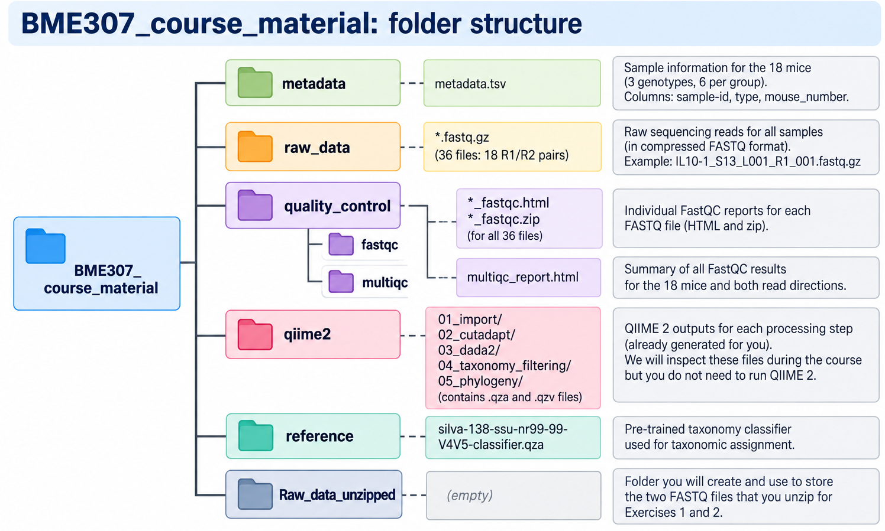
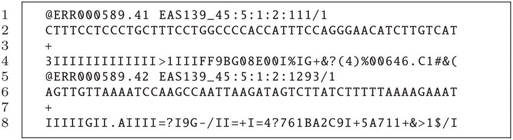

# 1. QIIME2 Workflow: From FASTQ reads to microbiome analysis objects

This practical follows 16S rRNA V4–V5 sequencing data from **18 mice**: six wild type, six IL-10 deficient and six MUC2 deficient. We ask whether host genotype is associated with gut microbiome composition and diversity.

The workflow follows the data from raw sequencing reads to the files that will later be combined and analysed in RStudio.

!!! important "What will you run during the practical?"
    You will inspect raw FASTQ files and run **FastQC** on selected files. The **QIIME 2 processing has already been run for you**. We will explain each QIIME 2 step and inspect its inputs and outputs, but you do not need to install or run QIIME 2 during the practical.

## Workflow

```text
FASTQ reads → quality control → primer trimming → denoising → ASVs
            → taxonomic classification → non-target filtering
            → phylogenetic tree reconstruction → phyloseq object generation for R
```

## Folder structure



----

# 1. Inspecting the FASTQ files

The analysis begins with the sequencing output. Each mouse has an **R1 file** containing forward reads and an **R2 file** containing reverse reads. The two reads cover the same amplified DNA fragment from opposite directions and will later be joined.

Each FASTQ read is stored as an entry with four lines:

1. The first line contains a **sequence identifier**, including information about the sequencing run and the cluster. It usually begins with an `@`;
2. The second line contains the **nucleotide calls of the sequence** (A, C, G, T and occasionally N);
3. The third line comprises plus (+) sign, which acts as a separator;
4. The fourth line, which is important for the next step, provides information on the quality of each of the base calls. These are Phred +33 encoded, using ASCII characters to represent the numerical quality scores.

An example of one entry of a FASTQ file:



The image above represents a single read; each FASTQ file contains many thousands of these entries.

???+ question "Exercise 1 — Explore the raw reads"
    Select **two FASTQ files belonging to the same mouse**: one forward-read file (`R1`) and its corresponding reverse-read file (`R2`).

    Copy these two files into a new folder called `Raw_data_unzipped` and unzip the copies. **Keep the original `.fastq.gz` files unchanged.**

    On macOS, you can unzip a copied file from Terminal with:

    ```bash
    gzip -d NAME_OF_THE_FILE.fastq.gz
    ```

    On Windows, you can extract the copied files using your usual archive/extraction tool.

    Explore the two uncompressed FASTQ files using the command-line commands introduced previously.

    1. Is the file format as expected?
    2. How many reads (entries) are there in each of these two files?

---

# 2. Quality Control: check sequence quality with FastQC and MultiQC

Sequencers do not read every nucleotide with equal confidence. Sequence quality can vary along a read and commonly declines towards the end, particularly for reverse reads.

**FastQC** evaluates each FASTQ file separately and summarizes features such as per-base sequence quality, read length, GC content and sequence duplication. A warning in FastQC is a diagnostic signal, not automatically a reason to discard a sample.

**MultiQC** combines the FastQC results from multiple samples into one report. This makes it easier to compare the 18 mice and the two read directions and to identify unusual samples.

**Input:** 36 compressed FASTQ files (18 R1/R2 pairs)  
**Outputs:** individual FastQC reports and one pre-generated MultiQC report

---

???+ question "Exercise 2A — FastQC"

    Run FastQC on the **same R1 and R2 files that you selected and unzipped in Exercise 1**.

    First, navigate in Terminal (macOS/Linux) or PowerShell (Windows) to the main `BME307_course_material` folder.

    Create a folder in which to save your FastQC results:

    === "macOS / Linux"

        ```bash
        mkdir -p results/fastqc
        ```

    === "Windows (PowerShell)"

        ```powershell
        New-Item -ItemType Directory -Force results/fastqc
        ```

    Now run FastQC on the two uncompressed FASTQ files in your `Raw_data_unzipped` folder:

    === "macOS / Linux"

        ```bash
        fastqc Raw_data_unzipped/*.fastq --outdir results/fastqc
        ```

    === "Windows (PowerShell)"

        ```powershell
        fastqc Raw_data_unzipped/*.fastq --outdir results/fastqc
        ```

    FastQC will generate two files for each FASTQ file:

    - an `.html` report that can be opened in a web browser;
    - a `.zip` file containing the underlying FastQC results.

    Open the **two `.html` FastQC reports** in:

    ```text
    results/fastqc/
    ```

    Answer the following questions:

    1. Overall, which file has higher per-base quality scores, R1 or R2?
    2. In each file, at approximately which read position does base quality begin to decline?

---

???+ question "Exercise 2B — MultiQC"

    Rather than inspecting all 36 FastQC reports individually, we can use **MultiQC** to compare the complete dataset in a single report.

    A MultiQC report containing the FastQC results for **all 36 FASTQ files** has already been generated for you.

    Open:

    ```text
    quality_control/multiqc/multiqc_report.html
    ```

    Work in pairs and compare the 18 mice and both read directions.

    1. Do forward (R1) and reverse (R2) reads have the same quality profile?
    2. Where does sequence quality begin to decline?
    3. Does any sample behave noticeably differently from the others? If so, which sample(s) and what do you observe?

!!! note
    FastQC warnings are diagnostic signals, not automatic reasons to discard data. When paired-end reads are later truncated during denoising, sequence quality is not the only consideration. Enough overlap between R1 and R2 must remain for the two reads to be merged.

---

# 3. Read processing with QIIME 2

The next steps in the workflow have already been performed in **QIIME 2 (2026.7)**. These include importing the FASTQ files, primer trimming, denoising, forward and reverse read merging, chimera removal, taxonomic classification, filtering of non-target sequences and phylogenetic tree reconstruction.

These processing steps generate the main microbiome analysis outputs, including the **ASV count table**, **taxonomic classification table** and **phylogenetic tree**.

You will **not run these QIIME 2 commands during the practical**. Instead, we will explain how each step was performed and inspect the corresponding output files. The commands are provided in collapsible boxes so that the analysis remains transparent and reproducible, and so that you can reproduce the workflow independently if you wish.

## 3.1 Importing the reads

As introduced in the **QIIME 2 primer**, QIIME 2 stores data in structured files called **artifacts (`.qza`)**. Interactive visualizations are stored as **`.qzv` files** and can be opened using [QIIME 2 View](https://view.qiime2.org/).

Importing the raw FASTQ files packages the complete paired-end dataset into a QIIME 2 artifact and begins a provenance record of how the data were processed.

Importing does **not** alter the nucleotide sequences and does **not** combine the 18 mice into one sample. The sample identities and their corresponding R1 and R2 reads remain distinct within the artifact.

**Input:** demultiplexed paired-end FASTQ reads  
**Outputs:** imported paired-end reads and a visualization of read counts and quality

??? info "Show the QIIME 2 commands"

    ```bash
    qiime tools import \
      --type 'SampleData[PairedEndSequencesWithQuality]' \
      --input-path raw_data \
      --input-format CasavaOneEightSingleLanePerSampleDirFmt \
      --output-path qiime2/01_import/01-demux-paired-end.qza

    qiime demux summarize \
      --i-data qiime2/01_import/01-demux-paired-end.qza \
      --o-visualization qiime2/01_import/01-demux-paired-end-summary.qzv
    ```

???+ question "Exercise 3.1 — Inspect the imported reads"

    Open **QIIME 2 View**:  
    <https://view.qiime2.org/>

    Drag and drop the following file into QIIME 2 View:

    ```text
    qiime2/01_import/01-demux-paired-end-summary.qzv
    ```

    === "Basic — Check the “Overview” tab"

        1. How many forward and reverse reads are there overall?
        2. For the samples you examined with FastQC, how many forward reads and reverse reads are there?
        3. Do any samples stand out, for example by having a particularly high or low number of reads?

    === "Advanced — Check the “Interactive” tab"

        1. Look at the plots and the quality scores. What trends do you observe in terms of quality-score changes in the forward and reverse reads?
        2. Scroll down to the **Demultiplexed sequence length summary**. What is the read length? How much overlap do you expect between the forward and reverse reads?

---

## 3.2 Primer trimming with Cutadapt

The bacterial 16S rRNA gene is longer than the region sequenced in this experiment. During PCR, short synthetic DNA sequences called **primers** bind on either side of the V4–V5 region and allow this region to be amplified.

Primer sequences are therefore technical components of the laboratory protocol, not biological variation among the mice. If retained, they can interfere with read merging, sequence comparison and taxonomic classification.

To remove them, we use the QIIME 2 **Cutadapt** plugin, which searches for the expected forward and reverse primer sequences and trims them from the reads where they are found.

The primers used here are:

- Forward primer: `GTGYCAGCMGCCGCGGTAA`
- Reverse primer: `CCGYCAATTYMTTTRAGTTT`

Letters such as `Y` and `M` are **IUPAC ambiguity codes**, allowing a primer position to match more than one nucleotide. We can discard reads in which the expected primer is not detected because they may be incomplete, incorrectly oriented or unrelated to the intended amplicon.

**Input:** imported paired-end reads  
**Outputs:** primer-trimmed reads, trimming statistics and a summary visualization

??? info "Show the QIIME 2 commands"

    ```bash
    qiime cutadapt trim-paired \
      --i-demultiplexed-sequences qiime2/01_import/01-demux-paired-end.qza \
      --p-front-f GTGYCAGCMGCCGCGGTAA \
      --p-front-r CCGYCAATTYMTTTRAGTTT \
      --p-match-adapter-wildcards \
      --p-discard-untrimmed \
      --p-cores 4 \
      --verbose \
      --o-trimmed-sequences qiime2/02_cutadapt/02-demux-trimmed.qza \
      --o-stats qiime2/02_cutadapt/02-cutadapt-stats.qza

    qiime demux summarize \
      --i-data qiime2/02_cutadapt/02-demux-trimmed.qza \
      --o-visualization qiime2/02_cutadapt/02-demux-trimmed-summary.qzv

    qiime cutadapt tabulate \
      --i-data qiime2/02_cutadapt/02-cutadapt-stats.qza \
      --o-visualization qiime2/02_cutadapt/02-cutadapt-stats.qzv
    ```

???+ question "Exercise 3.2 — Inspect primer trimming"

    Open **QIIME 2 View** and drag in:

    ```text
    qiime2/02_cutadapt/02-demux-trimmed-summary.qzv
    ```

    === "Basic — Check the “Overview” tab"

        1. What are wobble bases? What does `--p-match-adapter-wildcards` do?  
           Tip: consult the [Cutadapt documentation](https://cutadapt.readthedocs.io/en/stable/).

        2. What does `--p-discard-untrimmed` do? What kinds of reads might not get trimmed?

        3. For the same samples that you examined with FastQC, how many forward and reverse reads remain after primer trimming?

    === "Advanced — Check the “Interactive” tab"

        1. What are the read lengths after primer trimming?
        2. What were the lengths of the forward and reverse primer sequences?
        3. Does the change in read length correspond to what you would expect after removing the primers?

    If you would like to inspect the detailed Cutadapt trimming statistics, you can also open:

    ```text
    qiime2/02_cutadapt/02-cutadapt-stats.qzv
    ```

    Examine the trimming statistics for the forward and reverse reads.

    1. Were the expected primers detected in most forward and reverse reads? 

---


## 3.3 Denoising with DADA2

Even high-quality sequencing reads contain errors. If every observed sequence were treated as a genuine biological sequence, sequencing errors would artificially inflate the apparent diversity.

**DADA2** models sequencing errors and infers the biological sequences most likely to have been present. These exact inferred sequences are called **amplicon sequence variants (ASVs)** and may differ by as little as one nucleotide.

The main DADA2 operations are:

1. **Filtering and truncation:** low-quality reads are removed and, optionally, reads are shortened to a selected length.
2. **Error learning and denoising:** repeated error patterns are learned from the data and used to distinguish likely sequencing errors from biological variants.
3. **Dereplication:** identical reads are grouped together and represented as unique sequences with their corresponding abundances.
4. **Paired-read merging:** compatible forward and reverse reads are joined using their overlapping region.
5. **Chimera removal:** artificial sequences formed from two templates during PCR are identified and removed.

The truncation length must balance quality and overlap. Here, both forward and reverse reads were truncated to **225 bases**. The truncation length was selected based on the quality profiles while retaining sufficient overlap for paired-read merging.

**Input:** primer-trimmed reads  
**Outputs:** ASV count table, representative ASV sequences and denoising statistics

??? info "Show the QIIME 2 commands"

    ```bash
    qiime dada2 denoise-paired \
      --i-demultiplexed-seqs qiime2/02_cutadapt/02-demux-trimmed.qza \
      --p-trunc-len-f 225 \
      --p-trunc-len-r 225 \
      --p-n-threads 4 \
      --o-table qiime2/03_dada2/03-table.qza \
      --o-representative-sequences qiime2/03_dada2/03-rep-seqs.qza \
      --o-denoising-stats qiime2/03_dada2/03-denoising-stats.qza

    qiime metadata tabulate \
      --m-input-file qiime2/03_dada2/03-denoising-stats.qza \
      --o-visualization qiime2/03_dada2/03-denoising-stats.qzv

    qiime feature-table summarize \
      --i-table qiime2/03_dada2/03-table.qza \
      --m-sample-metadata-file metadata/metadata.tsv \
      --o-visualization qiime2/03_dada2/03-table.qzv

    qiime feature-table tabulate-seqs \
      --i-data qiime2/03_dada2/03-rep-seqs.qza \
      --o-visualization qiime2/03_dada2/03-rep-seqs.qzv
    ```

After DADA2, three outputs are particularly important:

- an **ASV count table**, containing the unique sequences and their abundance in each mouse;
- **representative sequences**, a fasta file containing one DNA sequence for each ASV unique sequence;
- **denoising statistics**, showing how many reads remain through the different DADA2 processing stages.

???+ question "Exercise 3.3 — Inspect the DADA2 outputs"

    **1. Inspect the ASV count table**

    Open the following file in **QIIME 2 View**:

    ```text
    qiime2/03_dada2/03-table.qzv
    ```

    In the **Overview** tab:

    1. What does the **number of features** represent? How many ASVs were detected across the 18 samples?
    2. What does **total frequency** represent?
    3. The ASV count table contains samples as columns and ASVs as rows. What does one value in this table represent?
    4. Get together in pairs and calculate the **percentage of reads retained after denoising for each sample**. To obtain the number of reads before denoising, compare with:

       ```text
       qiime2/02_cutadapt/02-demux-trimmed-summary.qzv
       ```

       Calculate:

       ```text
       percentage retained = (reads after denoising / reads before denoising) × 100
       ```

    **2. Inspect the representative ASV sequences**

    Open:

    ```text
    qiime2/03_dada2/03-rep-seqs.qzv
    ```

    Examine the **Sequence Length Statistics** and the **Sequence Table**.

    5. What does one representative sequence represent?
    6. After denoising with DADA2, we have obtained a set of amplicon sequence variants (ASVs). Why are the lengths of these sequences different from the lengths of the reads in the original FASTQ files?

    **3. Inspect the denoising statistics**

    Finally, open:

    ```text
    qiime2/03_dada2/03-denoising-stats.qzv
    ```

    This file shows how many reads remain at the different stages of DADA2 processing.

    7. What stages are shown in this file? During which DADA2 stage are most reads lost?


---

## 3.4 Taxonomic classification

An ASV sequence such as `ACGT...` does not by itself provide a familiar microbial name. **Taxonomic classification** connects each representative ASV sequence to taxonomic ranks such as domain, phylum, class, order, family and genus.

We perform this step using a **classifier**, which is a prediction model trained on sequences with known taxonomic labels from a reference database.

The classifier used here was built from **SILVA 138.1** reference sequences and trained specifically on the V4–V5 region targeted in this experiment. 

The classifier predicts the taxonomy of each representative ASV sequence and reports the most specific taxonomic assignment it can support, together with a confidence value. Classification may stop at a broader rank when the V4–V5 sequence cannot distinguish closely related taxa or when the reference database does not support a more specific assignment.

**Inputs:** representative ASV sequences and the trained classifier  
**Outputs:** taxonomic classification artifact and visualization

??? info "Show the QIIME 2 commands"

    ```bash
    qiime feature-classifier classify-sklearn \
      --i-classifier reference/silva-138.1-ssu-nr99-v4v5-classifier-qiime2-2026.7.qza \
      --i-reads qiime2/03_dada2/03-rep-seqs.qza \
      --o-classification qiime2/04_taxonomy_filtering/04-taxonomy.qza

    qiime metadata tabulate \
      --m-input-file qiime2/04_taxonomy_filtering/04-taxonomy.qza \
      --o-visualization qiime2/04_taxonomy_filtering/04-taxonomy.qzv
    ```

???+ question "Exercise 3.4 — Inspect the taxonomic classification"

    Open the following file in **QIIME 2 View**:

    ```text
    qiime2/04_taxonomy_filtering/04-taxonomy.qzv
    ```

    1. Which taxonomic ranks are reported?
    2. Are all ASVs classified to genus level?
    3. Can you identify any non-target sequences (non-bacterial)? If so, what are they?

    **Advanced**

    4. Choose one ASV from the taxonomy table and note its **Feature ID**.

       Open:

       ```text
       qiime2/03_dada2/03-rep-seqs.qzv
       ```

       Find the same Feature ID and copy its nucleotide sequence.

       Use [NCBI BLAST](https://blast.ncbi.nlm.nih.gov/Blast.cgi?PROGRAM=blastn&PAGE_TYPE=BlastSearch&LINK_LOC=blasthome) to search the sequence using `blastn`.

       Compare the BLAST result with the taxonomic classification obtained in QIIME 2.

       - Is the taxonomic assignment the same or different?
       - At what taxonomic rank do the two methods agree?

---

## 3.5 Filtering non-bacterial sequences

The experiment targets the prokaryotic 16S rRNA gene, but the amplified reads are not necessarily exclusively from the bacterial gut community of interest.

Mitochondria and chloroplasts evolved from bacterial ancestors and retain related ribosomal genes, so broad 16S primers can also amplify them. Other non-bacterial sequences may also arise through non-specific amplification or limitations in taxonomic classification.

These sequences can represent genuine DNA observations, but they do not answer our question about the **bacterial gut community**. We therefore retain ASVs classified within Bacteria while excluding chloroplast and mitochondrial assignments.

Filtering must be consistent across connected data objects. If an ASV is removed from the ASV count table, its representative sequence must also be removed so that downstream files contain matching ASV identifiers.

**Inputs:** unfiltered ASV count table, representative sequences and taxonomy  
**Outputs:** filtered bacterial ASV count table and matching representative sequences

??? info "Show the QIIME 2 commands"

    ```bash
    qiime taxa filter-table \
      --i-table qiime2/03_dada2/03-table.qza \
      --i-taxonomy qiime2/04_taxonomy_filtering/04-taxonomy.qza \
      --p-include 'd__Bacteria' \
      --p-exclude 'Chloroplast,Mitochondria' \
      --p-mode contains \
      --o-filtered-table qiime2/04_taxonomy_filtering/04-table-filtered.qza

    qiime feature-table filter-seqs \
      --i-data qiime2/03_dada2/03-rep-seqs.qza \
      --i-table qiime2/04_taxonomy_filtering/04-table-filtered.qza \
      --o-filtered-data qiime2/04_taxonomy_filtering/04-rep-seqs-filtered.qza

    qiime feature-table summarize \
      --i-table qiime2/04_taxonomy_filtering/04-table-filtered.qza \
      --m-sample-metadata-file metadata/metadata.tsv \
      --o-visualization qiime2/04_taxonomy_filtering/04-table-filtered.qzv
    ```

???+ question "Exercise 3.5 — Inspect the filtered ASV count table"

    Open:

    ```text
    qiime2/04_taxonomy_filtering/04-table-filtered.qzv
    ```

    1. How many ASVs remain after filtering?
    2. How many reads remain?

    **Checkpoint:** the filtered dataset contains **497 ASVs, 18 mice and 953,756 reads**.

---

## 3.6 Building a rooted phylogenetic tree

A **phylogenetic tree** models the evolutionary relationships among the representative ASV sequences. Each terminal tip represents one ASV, while the branching structure and branch lengths represent inferred sequence relationships.

QIIME 2 performs four main operations:

1. **Alignment:** MAFFT aligns homologous nucleotide positions across the ASV sequences.
2. **Masking:** highly variable or uninformative alignment positions are removed.
3. **Tree inference:** FastTree estimates an unrooted phylogenetic tree from the aligned sequences.
4. **Rooting:** midpoint rooting gives the tree a consistent root from which relationships can be interpreted.

The rooted tree provides information that taxonomic labels alone do not: it describes the amount of evolutionary history shared among ASVs. This information is required later for phylogenetic diversity measures such as **Faith's phylogenetic diversity** and **UniFrac** distances.

The tree is inferred from the sequenced 16S marker region; it is not a complete reconstruction of microbial evolution.

**Input:** filtered representative ASV sequences  
**Outputs:** aligned sequences, masked alignment, unrooted tree and rooted tree

??? info "Show the QIIME 2 commands"

    ```bash
    qiime phylogeny align-to-tree-mafft-fasttree \
      --i-sequences qiime2/04_taxonomy_filtering/04-rep-seqs-filtered.qza \
      --p-n-threads 4 \
      --o-alignment qiime2/05_phylogeny/05-aligned-rep-seqs.qza \
      --o-masked-alignment qiime2/05_phylogeny/05-masked-aligned-rep-seqs.qza \
      --o-tree qiime2/05_phylogeny/05-unrooted-tree.qza \
      --o-rooted-tree qiime2/05_phylogeny/05-rooted-tree.qza
    ```

???+ question "Exercise 3.6 — Connect the tree to downstream analysis"

    The rooted tree is stored as:

    ```text
    qiime2/05_phylogeny/05-rooted-tree.qza
    ```

    1. What does one terminal tip of the tree represent?
    2. Why must the tree-tip labels match the ASV identifiers in the ASV count table?
    3. Name one downstream diversity analysis that uses phylogenetic branch lengths.

!!! note
    The rooted tree is required for Faith's phylogenetic diversity and UniFrac distances. It is not required for observed richness, Shannon diversity, Bray–Curtis or Jaccard distances.

---